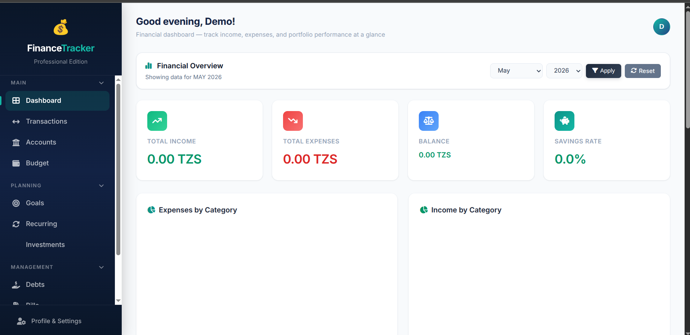
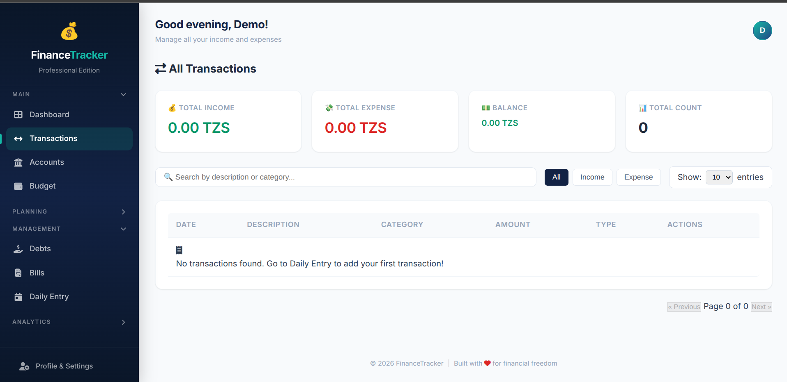
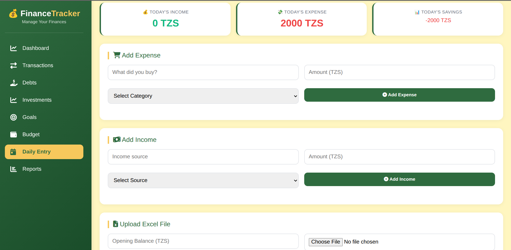
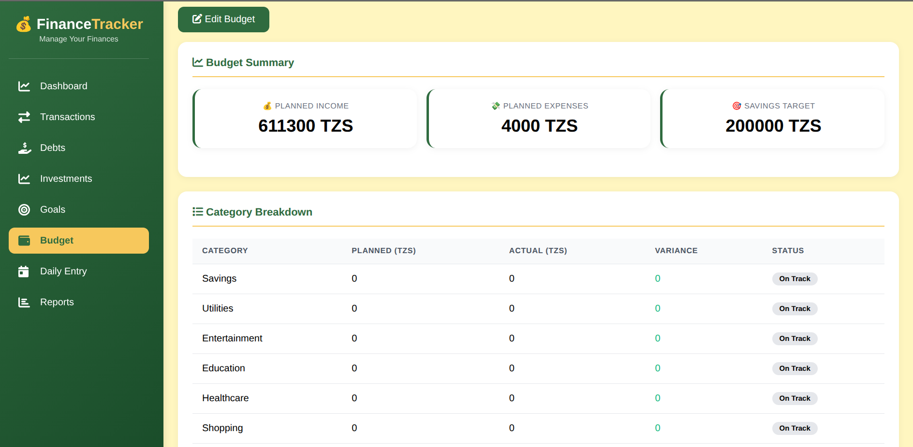

# 💰 Finance Tracker

A comprehensive personal finance management web application built with Spring Boot, MongoDB, and Thymeleaf. Track your income, expenses, debts, investments, goals, and budgets all in one place.


---

## ✨ Features

### 📊 Dashboard
- Real-time overview of total income, expenses, balance, and savings rate
- Charts for expense/income breakdown by category
- Weekly income vs expense trend
- Recent transactions, active goals, and debt summary

### 💸 Transactions
- View all income and expense transactions
- Search and filter by type (income/expense)
- Edit and delete transactions (soft delete)
- Transactions automatically sync with daily entries

### 💳 Debts & Lending
- Track money you owe (`I OWE`) and money owed to you (`OWED_TO_ME`)
- Record payments with remaining balance updates
- Payment history for each debt
- Filter by type, status, amount, and due date
- Pagination with adjustable page size

### 📈 Investments
- Manage stocks, real estate, business, crypto, and more
- Track invested amount, current value, and profit/loss
- Add transactions (deposit, withdrawal, interest, dividend)
- Visual progress bar for each investment

### 🎯 Goals
- Set financial goals with target amounts and dates
- Track progress with percentage completion
- Mark goals as complete and view achieved goals separately
- Add progress updates manually

### 💰 Budget
- Set monthly budget for different categories
- Compare planned vs actual spending
- Visual indicators for over/under budget
- Automatic alerts for budget exceedances

### 📅 Daily Entry
- Quick daily expense/income recording
- Excel file upload for bulk entries
- Download Excel template
- View history of all daily entries

### 📈 Reports
- Monthly financial summary with charts
- Expense breakdown by category
- Debt and investment summaries
- Select any month/year for historical reports

---

## 🛠️ Technologies Used

| Layer      | Technology                                                         |
|------------|--------------------------------------------------------------------|
| Backend    | Java 17, Spring Boot 3.2, Spring Security, Spring Data MongoDB     |
| Frontend   | Thymeleaf, HTML5, CSS3, JavaScript, Chart.js                       |
| Database   | MongoDB                                                            |
| Build Tool | Maven                                                              |
| Security   | Spring Security (form-based authentication)                        |
| Other      | Font Awesome, Excel processing (Apache POI)                        |

---

## 🚀 Getting Started

### Prerequisites

- **Java 17** or higher
- **Maven** 3.6+
- **MongoDB** 6.0+ (local or Atlas)

### Installation

1. **Clone the repository**

   ```bash
   git clone https://github.com/master-bry/finance.git
   cd finance
   ```

2. **Configure MongoDB**

   Update `src/main/resources/application.properties` with your MongoDB connection:

   ```properties
   spring.data.mongodb.uri=mongodb://localhost:27017/finance_tracker
   ```

3. **Build the project**

   ```bash
   mvn clean install
   ```

4. **Run the application**

   ```bash
   mvn spring-boot:run
   ```

5. **Access the application**

   Open your browser and navigate to `http://localhost:8080`. Register a new account or use default credentials if configured.

---

## 📁 Project Structure

```
src/main/java/com/master/finance/
├── controller/          # Spring MVC Controllers
├── model/               # MongoDB Document Entities
├── repository/          # Spring Data MongoDB Repositories
├── service/             # Business Logic Services
└── config/              # Security & Web Configuration

src/main/resources/
├── static/css/          # Custom CSS files
├── templates/           # Thymeleaf HTML templates
│   ├── layout.html      # Main layout template
│   ├── dashboard.html
│   ├── transactions/
│   ├── debts/
│   ├── investments/
│   ├── goals/
│   ├── budget/
│   ├── excel/
│   └── reports/
└── application.properties
```

---

## 📸 Screenshots

| Dashboard | Transactions |
|-----------|-------------|
|  |  |

| Debts | Budget |
|-------|--------|
|  |  |


----

## 🔒 Security

- All user data is isolated by `userId`
- Passwords are encoded using BCrypt
- Form login with Spring Security
- Session management and CSRF protection enabled

---

## 📄 License

This project is licensed under the MIT License — see the [LICENSE](LICENSE) file for details.

---

## 🤝 Contributing

Contributions are welcome! Feel free to open issues or submit pull requests for improvements, bug fixes, or new features.

1. Fork the project
2. Create your feature branch (`git checkout -b feature/AmazingFeature`)
3. Commit your changes (`git commit -m 'Add some AmazingFeature'`)
4. Push to the branch (`git push origin feature/AmazingFeature`)
5. Open a Pull Request

---

## 👨‍💻 Author

- GitHub: [@master-bry](https://github.com/master-bry)
- Email: bryngowi2@gmail.com

---

## 🙏 Acknowledgements

- [Spring Boot](https://spring.io/projects/spring-boot)
- [MongoDB](https://www.mongodb.com/)
- [Thymeleaf](https://www.thymeleaf.org/)
- [Chart.js](https://www.chartjs.org/)
- [Font Awesome](https://fontawesome.com/)